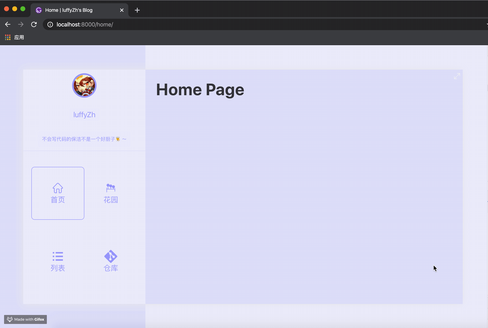

# gatsby-animate-blog

A cool blog site with gatsby by luffyZh.



## 🏠 [Demo](https://gatsby-animate-blog.luffyzh.now.sh/)

The demo deploy by now.

## ✨ Feature

 - Gatsby
 - React
 - Mo.js

## 📖 How to Use

U just need clone project in your repo. Then write the article with markdown file in `posts` folder.

> It is recommended that you install gatsby-cli before you begin

```
# Step1
npm install

# Step2
create new .md file in posts folder

# Step3

dev: gatsby develop                   // http://localhost:8000

prod: gatsby build && gatsby serve    // http://localhost:9000

deploy: now                           // https://[project-name].[yourname].now.sh
```

More questions u can PR | Issue | Star, Thanks~